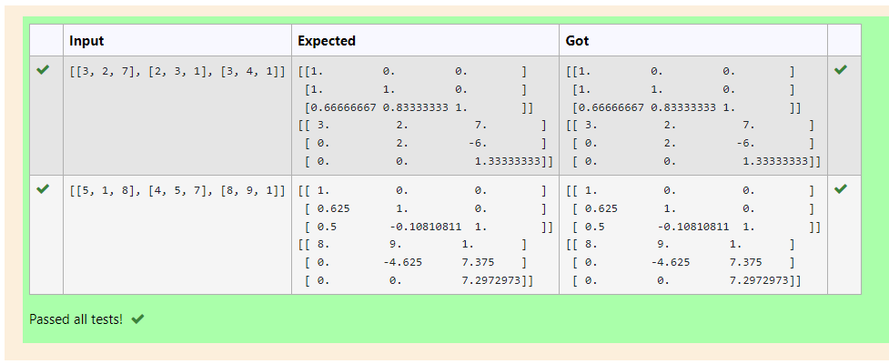
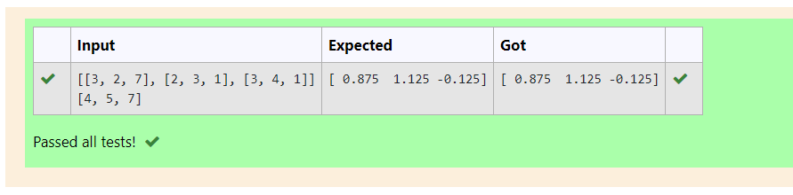

# LU Decomposition without zero on the diagonal

# 5(A)

## AIM:
To write a program to find the L,U matrix using LU Decomposition method.

## Equipments Required:
1. Hardware – PCs
2. Anaconda – Python 3.7 Installation / Moodle-Code Runner

## Algorithm:

### Step 1:
1. import numpy library using import statement.

### Step 2:
2. From scipy package import lu().

### Step 3:
3. Get input from user and pass it as an array.

### Step 4:
4. Get P, L U martix using lu().

### Step 5:
5. print L and U matrix.

## Program:
```
Program to find the LU Decomposition of a matrix.
Developed by: Vaishnavi M
RegisterNumber: 21500310

import numpy as np
from scipy.linalg import lu
A=np.array(eval(input()))
P,L,U,=lu(A)
print(L)
print(U)

```

## Output:



## Result:
Thus the program to find the LU Decomposition of a matrix is written and verified using python programming.


# LU Decomposition without zero on the diagonal

# 5(B)

## AIM:
To write a program to solve a matrix LU Decomposition method.

## Equipments Required:
1. Hardware – PCs
2. Anaconda – Python 3.7 Installation / Moodle-Code Runner

## Algorithm:

### Step 1:
1. import numpy library using import statement.

### Step 2:
2. From scipy package import lu_factor and lu_solve.

### Step 3:
3. Get two inputs from the user and pass it as an array

### Step 4:
4. fing lu and pivot value of the matrix using lu_factor().

### STEP 5:
5. find solution of the matrix by using lu_solve() by passing lu,pivot values as first arugment and second matrix as second arugment.

### STEP 6:
6. print the solution.

## Program:
```
Program to find the LU Decomposition of a matrix.
Developed by: Vaishnavi M
RegisterNumber: 21500310

import numpy as np
from scipy.linalg import lu_factor, lu_solve
A=np.array(eval(input()))
B=np.array(eval(input()))
lu,pivot=lu_factor(A)
x=lu_solve((lu,pivot),B)
print(x)


```

## Output:



## Result:
Thus the program to find the LU Decomposition of a matrix is written and verified using python programming.
